## Making a Aave Flash Loan

### 1. About Aave

> Aave is an open source and non-custodial liquidity protocol for earning interest on deposits and borrowing assets.

Aave is like a decentralized pseudo-bank. Instead of a central bank that validates all of the transactions, Aave has smart contracts to automated all of this work. Depositors put their tokens into Aave, and begin earning interest on their deposit. Borrowers, on the other hand, will take tokens out of Aave and will begin accruing interest on the amount borrowed. In order to do this, they must be [overcollateralized](https://www.investopedia.com/terms/o/overcollateralization.asp).

There is another method for those that don’t want to deposit tokens into Aave, and just want to borrow. This is the flash loan that this tutorial is about.

### 2. About Flash Loans
Flash loans are a new way of borrowing assets on the blockchain. Initially implemented by Aave, other trending DeFi protocols such as [dYdX](https://dydx.exchange/) quickly added this feature. There is a property that all Ethereum transactions share that enable flash loans to be possible. And this key feature is atomicity.

A transaction is atomic if the series of its operations are indivisible and irreducible. In other words — either all or none of the transaction occurs. The flash loan leverages atomicity to allow a user to borrow without posting collateral. There are two caveats to mention. First of all, whenever you borrow an asset in a flash loan you have to pay a fee of 0.09% of the amount loaned. Secondly, you must pay back the loan in the same transaction in which you borrowed. Flash loans are primarily used for arbitrage between assets.

### 3. Remix Setup

For this tutorial, we'll be using [Remix](https://remix.ethereum.org/), the browser based IDE. 

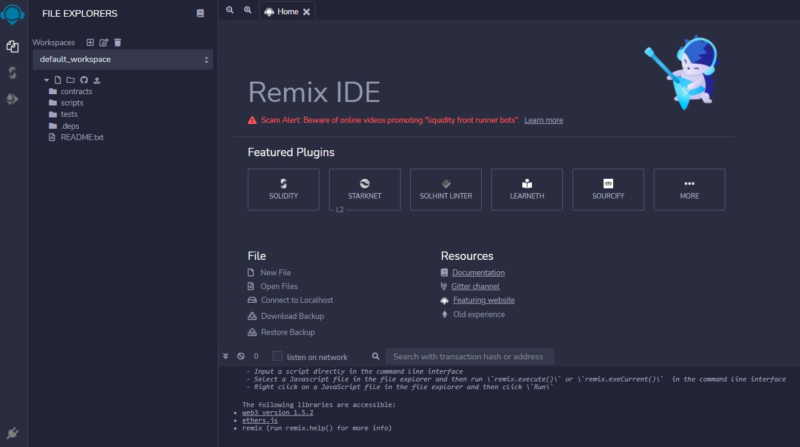

### 4. Metamask Setup

MetaMask is a browser plugin that serves as an Ethereum wallet. Once installed, it allows users to store Ether and other ERC-20 tokens, enabling them to make transactions to any Ethereum address.

You can install MetaMask [here](https://metamask.io/).

### 5. The Smart Contract

Create the following 6 files in the `contracts` folder in your `default_workspace` of Remix.

- FlashLoan.sol
- FlashLoanReceiverBase.sol
- IFlashLoanReceiver.sol
- ILendingPoolAddressesProvider.sol
- ILendingPool.sol
- Withdrawable.sol

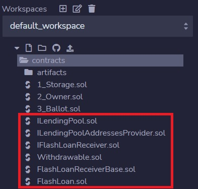

Our flash loan contract (`FlashLoan.sol`) inherits from the [abstract contract](https://docs.soliditylang.org/en/v0.6.2/contracts.html#abstract-contracts) `FlashLoanReceiverBase.sol`. An abstract contract is used as base contract so that the child contract can inherit and utilize its functions.

To receive flash loaned amounts, our contract must conform to the `IFlashLoanReceiver.sol` interface by implementing the relevant `executeOperation()` function.

`ILendingPool.sol` and `ILendingPoolAddressesProvider.sol` are [interfaces](https://www.geeksforgeeks.org/solidity-basics-of-interface/) that allow our flash loan contract to interact with the Aave market.

Next we break down the code in our flash loan contract `FlashLoan.sol`.

`pragma solidity ^0.6.6;`


First, we define the solidity compiler version (`0.6.6`).

`import "./FlashLoanReceiverBase.sol";`
`import "./ILendingPool.sol";`

Then, we import the dependencies for the smart contract. The flash loan contract is inheriting from the `FlashLoanReceiverBase` abstract contract.

`constructor(address _addressProvider) FlashLoanReceiverBase(_addressProvider) public {}`

To instaniate the flash loan contract, we need to pass it the address of one of the [Lending Pool Addresses Provider](https://docs.aave.com/developers/v/1.0/deployed-contracts/deployed-contract-instances) of Aave.  For this tutorial, we will be working with V1 contracts from the Kovan testnet.


```
function flashloan() public onlyOwner {
    /**
    * Flash Loan of 1000 DAI
    */
    address receiver = address(this); // Can also be a separate contract
    address asset = "0x6b175474e89094c44da98b954eedeac495271d0f"; // Dai
    uint256 amount = 1000 * 1e18;
    
    // If no params are needed, use an empty params:
    bytes memory params = "";
    // Else encode the params like below (bytes encoded param of type `address` and `uint`)
    // bytes memory params = abi.encode(address(this), 1234);
    
    ILendingPool lendingPool = ILendingPool(addressesProvider.getLendingPool());
    lendingPool.flashLoan(address(this), asset, amount, params);
}
```

We define a `flashloan()` function and in it we set the address of the asset's lending pool (DAI on Kovan), from which we wish to flash loan.

We alo set the amount of DAI we wish to loan in terms of `wei` (10^18).

No data parameters are needed, so we pass in an empty string.

Next, we initialize the lending pool interface (`ILendingPoolV1`) provided by Aave. And we call the `flashLoan` function, using the 4 parameters i.e. address of our contract, address of the asset we wish to loan, the amount to loan, and the data parameter.

```
    function executeOperation(
        address _reserve,
        uint256 _amount,
        uint256 _fee,
        bytes calldata _params
    )
        external
        override
    {
        require(_amount <= getBalanceInternal(address(this), _reserve), "Invalid balance, was the flashLoan successful?");

        //
        // Your logic goes here.
        // !! Ensure that *this contract* has enough of `_reserve` funds to payback the `_fee` !!
        //

        uint totalDebt = _amount.add(_fee);
        transferFundsBackToPoolInternal(_reserve, totalDebt);
    }
```

After receiving the loan, we need to define how to utilize the loan.  This is done in the `executeOperation` function.  This function is called internally after the `flashLoan` function is successfully executed.  

The `executeOperation` function takes 4 parameters i.e. the address of the reserve to which we have to pay back the loan, the amount of the asset, the fee that is charged by the Aave protocol, and any additional parameters used internally by the function. 

First, it checks if the loan `_amount` is correct. Then proceeds to execute the code for our use case e.g. arbitrage.  After which, the total debt is calculated and transferred back to the lending pool.

### 6. Deploy the Contract

#### 6.1 Open MetaMask and select the `Kovan Test Network`.
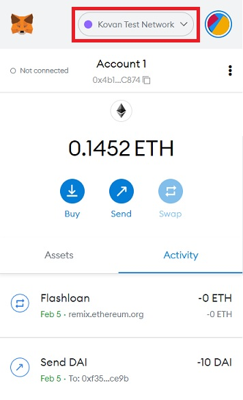

#### 6.2 Complete Dependency Files

Click on the links below and, copy and paste the code into the corresponding Solidity files created earlier.
- [FlashLoanReceiverBase](contracts/FlashLoanReceiverBase.sol)
- [IFlashLoanReceiver](contracts/IFlashLoanReceiver.sol)
- [ILendingPoolAddressesProvider](contracts/ILendingPoolAddressesProvider.sol)
- [ILendingPool](contracts/ILendingPool.sol)
- [Withdrawable](contracts/Withdrawable.sol)
  
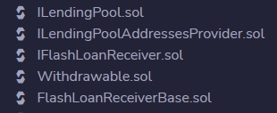

#### 6.3 Compile the Contract

Select the `Solidity compiler` icon on the left navigation bar.  Set the compiler version to `0.6.6` and click on the `Compile FlashLoan.sol` button.

There maybe some warnings but no errors.

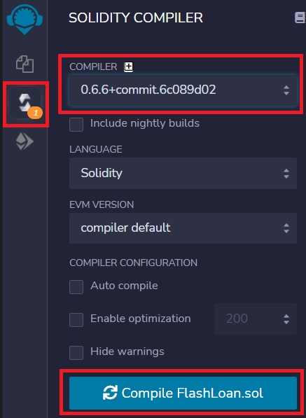

#### 6.4 Deploy to Kovan Testnet

Select the `Deploy & Run Transactions` icon on the left navigation bar.  Under the `ENVIRONMENT` section, set the `Injected Web3` option.  Metamask should open up asking your permission to connect to Remix.

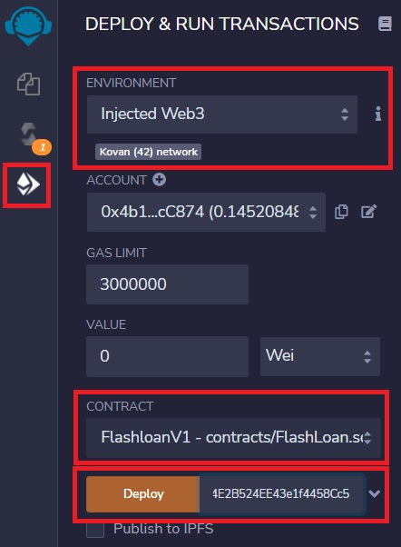

Check that the `CONTRACT` section is set to `FlashLoan.sol`. We need to provide the address of lending pool in the text field that is next to the `Deploy` button. In our case, it will be `0x506B0B2CF20FAA8f38a4E2B524EE43e1f4458Cc5`. Then click `Deploy`. It should open up MetaMask. 

> A list of all deployed contract addresses can be found [here](https://docs.aave.com/developers/v/1.0/deployed-contracts/deployed-contract-instances). You can find the addresses of various lending pools supported by Aave.

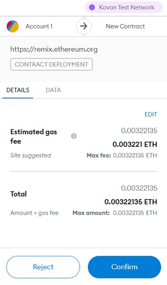

Click on `Confirm`, you should see a success notification from MetaMask. There should now be a `Deployed Contracts` in the side panel.

### 7. Funding the Flash Loan

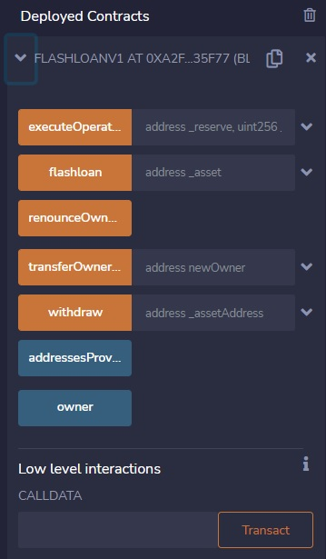

In the new `Deployed Contracts` section, you will be able to copy the deployed contract's address. We will need the contract address later; in the meantime, we need to fund our flash loan contract with some DAI. 

Flash Loans need funds in the contract to successfully execute. To fund our contract, you can click on this [link](https://testnet.aave.com/faucet/DAI) to get some DAI tokens. 

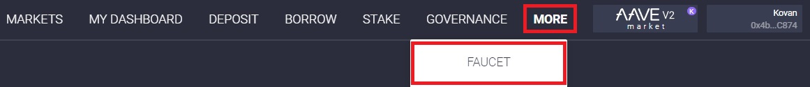

Click on the `MORE` dropdown menu, and click on the `FAUCET` option. 

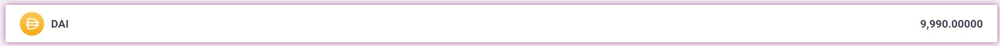

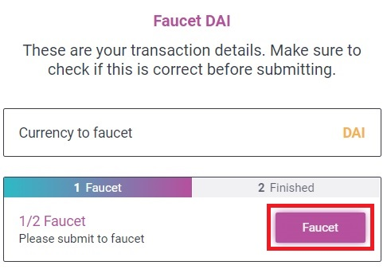

Select the DAI asset and click on the `Faucet` button.

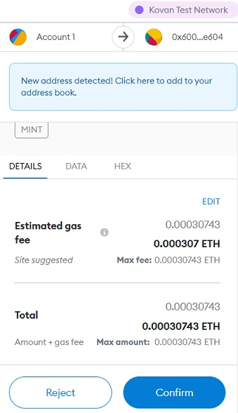

Confirm the minting transaction on MetaMask.

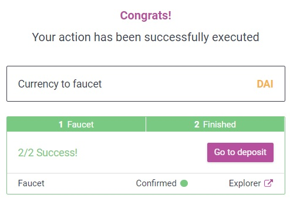

After successfully minting the DAI from the faucet, we need to add the DAI token to MetaMask.  

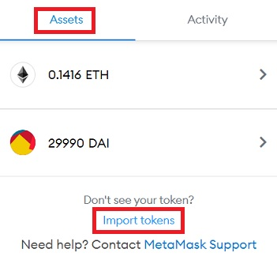

Open MetaMask, select the `Assets` tab and click on the `Import tokens` link.
